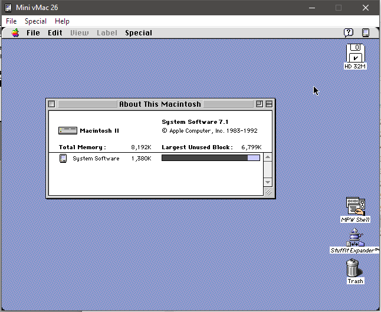

# µvMac 0.37.0

Forked from Mini vMac v36.4 by Paul C. Pratt (http://www.gryphel.com/c/minivmac), which was forked from vMac by Philip "PC" Cummins (http://www.vmac.org/main.html)

µvMac (micro vMac) is a small, simple emulator for early Motorola 68000 based emulators. Currently we support systems from the original Macintosh 128K all the way up to the Macintosh II.

This fork was created to clean up and modernize the code base, make the project easier to compile and hack on, and allow for much easier user configuration. The intent of Mini vMac was to create a "emulator collection" of many very optimized "variations" of the same codebase. I consider this much more trouble than it's worth, and intend to focus more on maintainability and accuracy.

## Screenshots

## Legal info

You can redistribute µvMac and/or modify it under the terms
of version 2 of the GNU General Public License as published by
the Free Software Foundation.  See the included file COPYING.txt

µvMac is distributed in the hope that it will be useful,
but WITHOUT ANY WARRANTY; without even the implied warranty of
MERCHANTABILITY or FITNESS FOR A PARTICULAR PURPOSE.  See the
license for more details.
