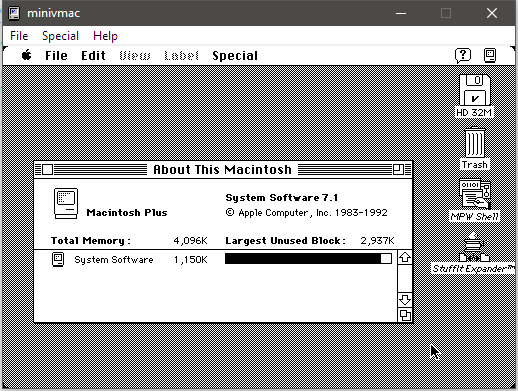
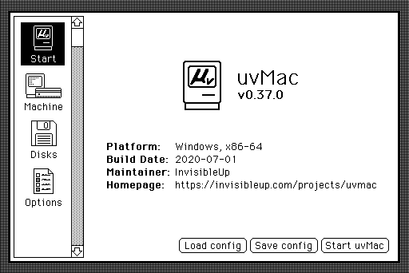
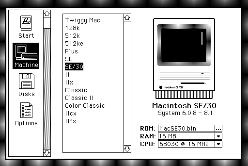
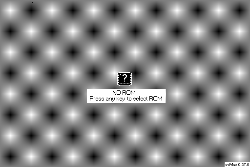

# µvMac 0.37.0

***THIS CODEBASE IS INCOMPLETE, MAY NEVER BE COMPLETE, AND DOES NOT CURRENTLY COMPILE TO A USABLE PRODUCT.***

Forked from Mini vMac v36.4 by Paul C. Pratt (http://www.gryphel.com/c/minivmac), which was forked from vMac by Philip "PC" Cummins (http://www.vmac.org/main.html)

µvMac (micro vMac) is a small, simple emulator for early Motorola 68000 based emulators. Currently we support systems from the original Macintosh 128K all the way up to the Macintosh II.

This fork was created to clean up and modernize the code base, make the project easier to compile and hack on, and allow for much easier user configuration. The intent of Mini vMac was to create a "emulator collection" of many very optimized "variations" of the same codebase. I consider this much more trouble than it's worth, and intend to focus more on maintainability and accuracy.

## How to Compile
µvMac uses the Meson build system. See https://mesonbuild.com/ for instructions on how to download and use it.

1. Install the SDL2 libraries (On Ubuntu/Debian, this is `sudo apt install libsdl2-dev`. On Windows, see below.)
2. `git clone --recursive` this repository
3. Run `meson setup build`
4. Navigate to the `build/` directory and run `meson compile`
5. Add `vMac.ROM` (and possibly libsdl2.dll) to the build directory and run the program!


On Windows systems, you may need to run the following commands for SDL to work:
```
mkdir subprojects/
meson wrap install sdl2
```

Also, for now, for the M68K core to work, you need to compile Musashi yourself. Follow the instructions in that project's README for details.


## Supported Platforms

µvMac *absolutely requires* SDL2. There are no plans to support platforms that SDL2 does not target. For 99% of users, this should not be a concern. Dropping support for esoteric platforms and exclusively using SDL2 vastly simplifies the complexity of the code.

Here's an incomplete list of platforms that can, in theory, be targeted. These are listed in order of support.

- Linux
- Windows
- macOS
- FreeBSD/OpenBSD/NetBSD/etc.
- Haiku
- Emscripten

## Screenshots




<details>
<summary>Future features; not representative of final product</summary>
The below images are mockups of an upcoming feature, the configuration manager. This replaces Control Mode in Mini vMac, and also appears when you start the emulator.




The configuration manager will require resources from a ROM. Here's the screen you get when you start up for the first time, without a ROM.


</details>

## Legal Info

You can redistribute µvMac and/or modify it under the terms
of version 2 of the GNU General Public License as published by
the Free Software Foundation.  See the included file COPYING.txt

µvMac is distributed in the hope that it will be useful,
but WITHOUT ANY WARRANTY; without even the implied warranty of
MERCHANTABILITY or FITNESS FOR A PARTICULAR PURPOSE.  See the
license for more details.
